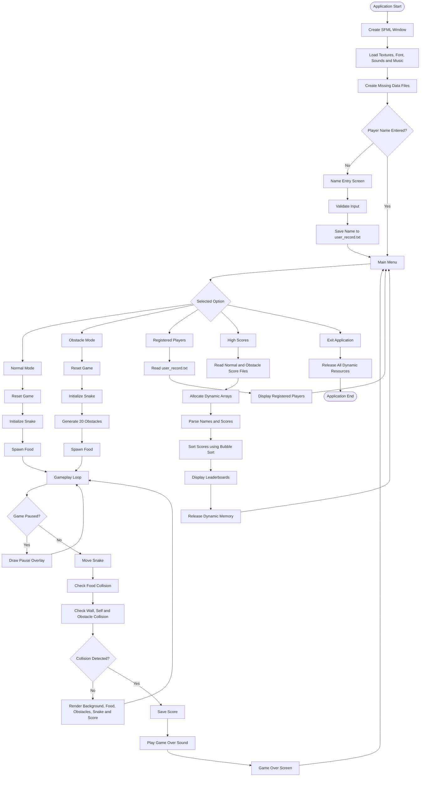

# Nokia-Snake-Game-SFML
🐍 A polished desktop implementation of the classic Nokia Snake Game using C++ &amp; SFML. Demonstrates 🧠 dynamic memory allocation, 📁 file handling, 🏆 score persistence &amp; Bubble Sort, 🎮 Normal/Obstacle modes, ⏸️ pause/resume, 🔊 audio, and 🎨 sprite-based graphics with efficient game-state management.

<div align="center">


<br/>

<!-- BADGES -->
<p>


</p>

<p>


</p>

<br/>

<!-- QUICK ACTION BUTTONS -->
<p>
<a href="#-quick-start"></a>
<a href="#️-sfml-setup-guide-visual-studio-2026"></a>
<a href="#-gameplay--controls"></a>
</p>
<p>
<a href="main.cpp"></a>
<a href="Screenshots/"></a>
<a href="assets/"></a>
<a href="LICENSE"></a>
</p>

</div>

<br/>

> **Note on interactivity:** GitHub sanitizes inline CSS/JavaScript inside rendered Markdown, so true "click-to-trigger" widgets can't run *inside* the README page itself. Every button above **is fully clickable** — each one is a real hyperlink that jumps you straight to the matching section or opens the matching file/folder in this repository. The typing banner and header wave *are* genuine animations (served as live SVGs), not static images.

<br/>

## 📋 Table of Contents

| | | |
|---|---|---|
| [🐍 About the Project](#-about-the-project) | [✨ Features](#-features) | [🧠 Concepts &amp; Techniques Used](#-concepts--techniques-used) |
| [🏗️ Project Architecture](#️-project-architecture) | [🕹️ Game Modes](#️-game-modes) | [🖼️ Screenshots](#-screenshots) |
| [📦 Prerequisites](#-prerequisites) | [⚙️ SFML Setup Guide](#️-sfml-setup-guide-visual-studio-2026) | [🚀 Quick Start](#-quick-start) |
| [🏗️ Project Structure](#️-project-structure) | [🎮 Gameplay & Controls](#-gameplay--controls) | [💾 Score & Data Persistence](#-score--data-persistence) |
| [🐞 Troubleshooting](#-troubleshooting) | [🗺️ Roadmap](#️-roadmap) | [🤝 Contributing](#-contributing) |
| [👥 Authors](#-authors) | [⚖️ License](#️-license) | [🙏 Acknowledgements](#-acknowledgements) |

<br/>

## 🐍 About the Project


**Nokia Snake Game — SFML Edition** is a desktop revival of the iconic snake game that shipped on the Nokia 3310, rebuilt from scratch in modern **C++20** using the **SFML 3.1.0** multimedia library.

It goes well beyond the classic single-mode grid crawler: this build features a full menu system, two distinct gameplay modes, persistent high-score leaderboards, sprite-based rendering, sound design, and pause/resume support — all powered entirely by manual, pointer-based dynamic memory management (no `std::vector`, no STL containers for game state) as a demonstration of core C++ fundamentals.

This project was built as an academic semester project to demonstrate mastery of:
- Manual dynamic memory allocation (`new` / `delete[]`) and lifecycle management
- File I/O and on-disk data persistence
- Classic sorting algorithms (Bubble Sort) implemented by hand
- Real-time event-driven application architecture with SFML
- Sprite/texture based 2D graphics, audio playback, and game-state machines

<br clear="right"/>

## ✨ Features

<table>
<tr>
<td width="50%" valign="top">

**🎮 Core Gameplay**
- Classic grid-based snake movement & growth
- Two selectable game modes (Normal / Obstacle)
- Progressive difficulty — speed increases every 5 points
- Wall, self-collision, and obstacle-collision detection
- Pause & resume mid-game (`P` key) with overlay

**🧑‍💻 Player System**
- On-launch name entry & registration
- Persistent "Registered Players" roster
- Per-mode high-score leaderboards (Top scores, sorted)

</td>
<td width="50%" valign="top">

**🎨 Presentation**
- Sprite-based rendering for snake head/body, food & obstacles
- Directional head/body rotation based on movement
- Looping background music + contextual SFX (eat / start / game over)
- Full custom menu with keyboard navigation & highlight states

**💾 Persistence & Data**
- Flat-file score persistence (`.txt`), survives restarts
- Automatic file creation on first run
- Hand-written Bubble Sort for descending leaderboard ranking

</td>
</tr>
</table>

<br/>

## 🧠 Concepts & Techniques Used

<div align="center">

| Concept | Where it's used |
|---|---|
| 🧮 **Dynamic Memory Allocation** | Snake body (`int* snakeX/snakeY`), obstacles, name/score arrays — all raw heap arrays, manually `delete[]`-d |
| 📁 **File Handling (`fstream`)** | `normal_scores.txt`, `obstacle_scores.txt`, `user_record.txt` created/read/appended at runtime |
| 🔃 **Bubble Sort** | Hand-implemented O(n²) descending sort applied to both leaderboards before rendering |
| 🧵 **Manual C-String Manipulation** | Digit-to-char score formatting & name concatenation done without `std::string` |
| 🎛️ **Finite State Machine** | `gameState` integer drives Menu → Name Entry → Normal/Obstacle Play → Game Over → Leaderboards |
| 🖱️ **Event-Driven Input Handling** | SFML 3's `pollEvent()` + `event->getIf<T>()` pattern for keyboard/text/window events |
| ⏱️ **Frame-Independent Timing** | `sf::Clock` gates snake movement by elapsed milliseconds, decoupled from render rate |
| 🧹 **RAII-adjacent Manual Cleanup** | Every `new` is paired with a null-checked `delete` at scope end / program exit |

</div>

<br/>

## 🏗️ Project Architecture

The project follows a **state-based procedural architecture**. A central game loop processes input, updates the active state, and renders the appropriate screen.



### Architecture Components

| Component | Responsibility |
|---|---|
| **Main Loop** | Polls SFML events and routes execution to the active screen |
| **State Manager** | Uses `gameState` to control menu, gameplay, players, scores, and game-over screens |
| **Input System** | Handles text entry, menu navigation, movement, pause, and escape actions |
| **Gameplay System** | Updates snake movement, food collection, speed, and collision logic |
| **Rendering System** | Draws the background, sprites, score text, menus, and overlays |
| **Persistence System** | Stores names and mode-specific scores in text files |
| **Memory Manager** | Allocates and releases snake, obstacle, player, and score arrays |

### Game-State Mapping

| State | Screen / Mode | Main Function |
|:---:|---|---|
| `nameEntered = false` | Name Entry | `enterName()` |
| `0` | Main Menu | `showMenu()` |
| `1` | Normal Mode | `playGame()` |
| `2` | Obstacle Mode | `playGame()` |
| `3` | Registered Players | `showPlayers()` |
| `4` | High Scores | `showScores()` |
| `5` | Game Over | `showGameOver()` |

<br/>

## 🕹️ Game Modes

<table>
<tr>
<th width="50%">🟢 Normal Mode</th>
<th width="50%">🧱 Obstacle Mode</th>
</tr>
<tr>
<td valign="top">

Pure classic snake on a clean **25×25** grid. Eat food, grow longer, avoid the walls and your own tail. Speed ramps up every 5 points, capped at a minimum move delay for late-game intensity.

</td>
<td valign="top">

Everything from Normal Mode, **plus 20 randomly-generated obstacles** scattered across the grid at level start (guaranteed to never spawn on the snake or overlap each other). One touch ends the run.

</td>
</tr>
</table>

<br/>

## 🖼️ Screenshots

<div align="center">

| Main Menu | Name Entry |
|:---:|:---:|
|  |  |

| Normal Mode | Obstacle Mode |
|:---:|:---:|
|  |  |

| Pause Screen | Game Over |
|:---:|:---:|
|  |  |

| Registered Players | High Scores |
|:---:|:---:|
|  |  |

</div>

<br/>

## 📦 Prerequisites

Before building, make sure you have the following installed:

| Requirement | Version | Notes |
|---|---|---|
| 🖥️ **OS** | Windows 10/11 (64-bit) | SFML binaries below target Windows + MSVC |
| 🛠️ **Visual Studio** | **2026** | Install with the **"Desktop development with C++"** workload |
| ⚙️ **C++ Standard** | **C++20** | Set in project properties (see setup guide) |
| 🎮 **SFML** | **3.1.0** | The multimedia/game library this project is built on |
| 🔧 **Build Tools** | MSVC v143+ toolset | Ships with the C++ workload above |
| 📦 **Git** | Latest | To clone the repository |

> 💡 **Tip:** SFML 3.x is a **major rewrite** compared to SFML 2.x — event handling, `VideoMode`, and vector construction all changed syntax. This project already targets **SFML 3.1.0** syntax (`event->is<Event::Closed>()`, `RenderWindow(VideoMode({...}), ...)`), so make sure you link **3.1.0**, not a 2.x package, or it will not compile.

<br/>

## ⚙️ SFML Setup Guide (Visual Studio 2026)

Choose **either** Option A (fastest, recommended) or Option B (manual, full control).

<details open>
<summary><b>🅰️ Option A — Install via vcpkg (Recommended)</b></summary>

<br/>

1. **Install vcpkg** (skip if you already have it):
   ```bash
   git clone https://github.com/microsoft/vcpkg.git
   cd vcpkg
   .\bootstrap-vcpkg.bat
   ```

2. **Integrate vcpkg with Visual Studio** (one-time, system-wide):
   ```bash
   .\vcpkg integrate install
   ```

3. **Install SFML 3.1.0**:
   ```bash
   .\vcpkg install sfml:x64-windows
   ```
   > This pulls in the graphics, window, system, and audio modules along with their dependencies (freetype, openal-soft, etc.) automatically.

4. **Open the project in Visual Studio 2026** — because vcpkg is integrated, headers and libraries resolve automatically. No manual include/lib paths required.

5. Set the project's **C++ Language Standard** to **ISO C++20**:
   `Project → Properties → General → C++ Language Standard → ISO C++20 Standard (/std:c++20)`

6. Build (`Ctrl+Shift+B`) and run (`F5`).

</details>

<details>
<summary><b>🅱️ Option B — Manual SFML Setup (No vcpkg)</b></summary>

<br/>

1. **Download SFML 3.1.0** for Visual Studio from the [official SFML downloads page](https://www.sfml-dev.org/download/sfml/3.1.0/) — grab the package matching your VS toolset (e.g. `SFML-3.1.0-windows-vc17-64-bit.zip`).

2. **Extract** it somewhere permanent, e.g. `C:\SFML-3.1.0\`.

3. In Visual Studio, open **Project → Properties** and set the configuration to **All Configurations / x64**:

   | Setting | Path |
   |---|---|
   | **C/C++ → General → Additional Include Directories** | `C:\SFML-3.1.0\include` |
   | **Linker → General → Additional Library Directories** | `C:\SFML-3.1.0\lib` |
   | **Linker → Input → Additional Dependencies** (Debug) | `sfml-graphics-d.lib; sfml-window-d.lib; sfml-system-d.lib; sfml-audio-d.lib` |
   | **Linker → Input → Additional Dependencies** (Release) | `sfml-graphics.lib; sfml-window.lib; sfml-system.lib; sfml-audio.lib` |

4. **Set C++20**:
   `C/C++ → Language → C++ Language Standard → ISO C++20 Standard (/std:c++20)`

5. **Copy the required `.dll` files** from `C:\SFML-3.1.0\bin\` into your project's output directory (same folder as the produced `.exe`, e.g. `x64\Debug\`):
   - `sfml-graphics-d-3.dll`, `sfml-window-d-3.dll`, `sfml-system-d-3.dll`, `sfml-audio-d-3.dll` (Debug)
   - `sfml-graphics-3.dll`, `sfml-window-3.dll`, `sfml-system-3.dll`, `sfml-audio-3.dll` (Release)
   - `openal32.dll` (required for audio)

   > 💡 To automate this, add a **Post-Build Event** in `Project → Properties → Build Events → Post-Build Event`:
   > ```bat
   > xcopy /y /d "C:\SFML-3.1.0\bin\*.dll" "$(OutDir)"
   > ```

6. Build (`Ctrl+Shift+B`) and run (`F5`).

</details>

<br/>

## 🚀 Quick Start

```bash
# 1. Clone the repository
git clone https://github.com/Nouman-Irfan/Nokia-Snake-Game-SFML.git

# 2. Move into the project directory
cd Nokia-Snake-Game-SFML

# 3. Open the solution/project in Visual Studio 2026
start .

# 4. Follow the SFML Setup Guide above, then:
#    Build  → Ctrl+Shift+B
#    Run    → F5
```

> ⚠️ **Run from the project root** (or ensure your working directory contains the `assets/` folder). The game loads textures, fonts, and audio using **relative paths** (e.g. `"assets/snake_head.png"`) — if the executable can't find `assets/`, sprites/audio will silently fail to load and the console will print load-error messages.

<br/>

## 🏗️ Project Structure

```
Nokia-Snake-Game-SFML/
│
├── 📁 assets/                    # All runtime resources (loaded via relative paths)
│   ├── 🖼️ snake_head.png
│   ├── 🖼️ snake_body.png
│   ├── 🖼️ snake_food.png
│   ├── 🖼️ snake_obstacle.png
│   ├── 🖼️ snake_background.png
│   ├── 🔤 font.ttf
│   ├── 🔊 apple_crunch.wav
│   ├── 🔊 game_start.wav
│   ├── 🔊 game_over.wav
│   └── 🎵 background_music.wav
│
├── 📁 Screenshots/                # README preview images
│   ├── Main Menu.png
│   ├── Name Entry.png
│   ├── Normal Mode.png
│   ├── Obstacle Mode.png
│   ├── Pause Screen.png
│   ├── Game Over.png
│   ├── High Scores.png
│   └── Registered Players.png
│
├── 📄 main.cpp                    # Entire game: menus, state machine, rendering, I/O
├── 📄 normal_scores.txt           # Auto-generated — Normal Mode leaderboard data
├── 📄 obstacle_scores.txt         # Auto-generated — Obstacle Mode leaderboard data
├── 📄 user_record.txt             # Auto-generated — registered player names
├── 📄 LICENSE                     # GNU GPLv3
└── 📄 README.md                   # You are here
```

<br/>

## 🎮 Gameplay & Controls

<div align="center">

| Key | Action |
|:---:|---|
| `↑` / `↓` | Navigate the main menu |
| `Enter` | Confirm menu selection / submit name |
| `W` `A` `S` `D` or `↑` `↓` `←` `→` | Move the snake (reverse direction is blocked) |
| `P` | Pause / Resume the current game |
| `Esc` | Save score & return to Main Menu / go back from sub-screens |
| `Backspace` | Delete last character during name entry |
| Any printable key | Type your name on the entry screen |

</div>

**Menu options:** `NORMAL MODE` → `OBSTACLE MODE` → `REGISTERED PLAYERS` → `HIGH SCORES` → `EXIT`

<br/>

## 💾 Score & Data Persistence

- On first launch, the game **auto-creates** `normal_scores.txt`, `obstacle_scores.txt`, and `user_record.txt` if they don't already exist.
- Every entered player name is appended to `user_record.txt` and viewable under **Registered Players**.
- On game over (or pressing `Esc` mid-run), the current run's `name,score` pair is appended to the matching mode's score file — guarded by a `scoreSaved` flag so a single run is never saved twice.
- The **High Scores** screen loads both files into dynamically-allocated arrays at runtime, ranks them with a hand-written **descending Bubble Sort**, renders the top entries side-by-side (Normal vs. Obstacle), and frees all allocated memory before returning to the menu.

<br/>

## 🐞 Troubleshooting

<details>
<summary><b>❌ "Font Load Error" / "Background Load Error" printed to console</b></summary>
<br/>
The executable isn't finding the <code>assets/</code> folder. Make sure your Visual Studio <b>Working Directory</b> (Project → Properties → Debugging → Working Directory) is set to <code>$(ProjectDir)</code>, and that <code>assets/</code> sits next to your <code>.exe</code> in Release builds.
</details>

<details>
<summary><b>❌ LNK2019 / LNK1120 unresolved external symbol errors</b></summary>
<br/>
This almost always means the SFML <code>.lib</code> files aren't linked, or you mixed Debug libs with a Release build (or vice versa). Double-check the <b>Linker → Input</b> settings match your active configuration exactly as shown in the setup guide.
</details>

<details>
<summary><b>❌ Game crashes immediately / missing DLL error on launch</b></summary>
<br/>
The required SFML <code>.dll</code> files (and <code>openal32.dll</code>) aren't next to the built <code>.exe</code>. Re-check step 5 of the manual setup, or confirm the vcpkg-integrated build copied them automatically.
</details>

<details>
<summary><b>❌ Compiler errors about <code>sf::Event</code> syntax</b></summary>
<br/>
You're likely linked against SFML <b>2.x</b> instead of <b>3.1.0</b>. This codebase uses the SFML 3 event API (<code>event->is&lt;Event::Closed&gt;()</code>), which does not exist in SFML 2.x.
</details>

<br/>

## 🗺️ Roadmap

- [ ] Migrate raw arrays to STL containers behind a compatibility layer (optional refactor)
- [ ] Add a settings screen (volume control, grid size, difficulty)
- [ ] Add wraparound / "no-walls" mode
- [ ] Cross-platform build via CMake for Linux/macOS

<br/>

## 🤝 Contributing

Contributions are welcome! To propose a change:

1. **Fork** the repository
2. **Create a branch**: `git checkout -b feature/your-feature-name`
3. **Commit your changes**: `git commit -m "Add: your feature"`
4. **Push to your fork**: `git push origin feature/your-feature-name`
5. **Open a Pull Request**

Please keep contributions consistent with the project's existing coding style (Allman-style braces, section-header comments, manual memory management).

<br/>

## 👥 Authors

<div align="center">

| | |
|:---:|:---:|
| **Muhammad Nouman** | **Aqsa Ismail** |
| [](https://github.com/Nouman-Irfan) | [](https://github.com/aqsaismail04) |

</div>

<br/>

## ⚖️ License

This project is licensed under the **GNU General Public License v3.0** — see the [LICENSE](LICENSE) file for full details.

<br/>

## 🙏 Acknowledgements

- [SFML](https://www.sfml-dev.org/) — Simple and Fast Multimedia Library
- Nokia — for the original 3310 Snake that inspired a generation of developers

<br/>

<div align="center">


**⭐ If you found this project useful, consider giving it a star! ⭐**

</div>
